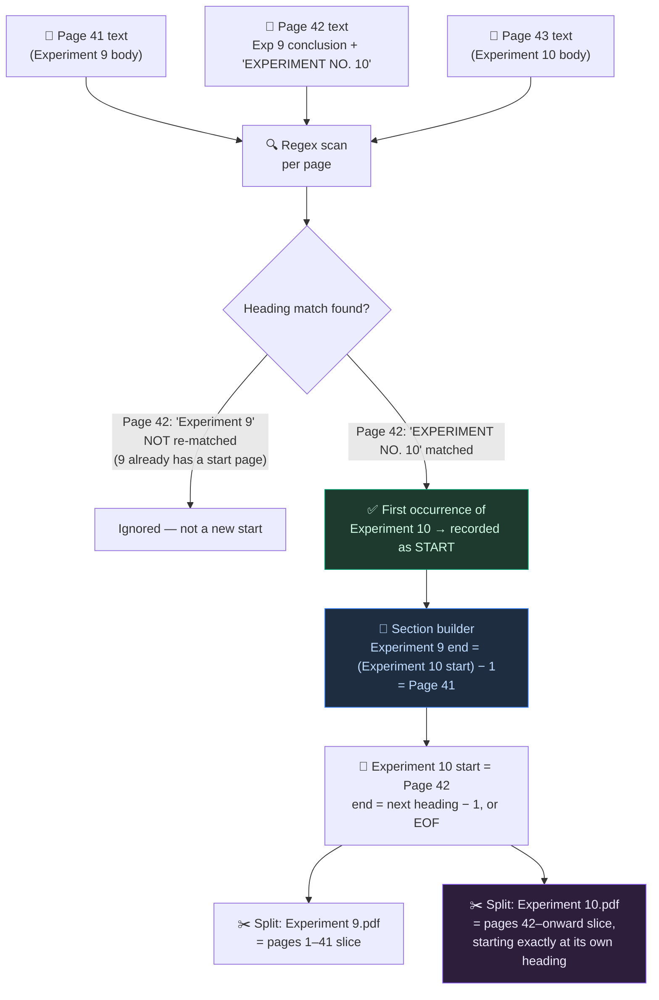

<div align="center">

<br/>

```
███████╗██████╗ ██╗     ██╗████████╗████████╗███████╗██████╗ 
██╔════╝██╔══██╗██║     ██║╚══██╔══╝╚══██╔══╝██╔════╝██╔══██╗
███████╗██████╔╝██║     ██║   ██║      ██║   █████╗  ██████╔╝
╚════██║██╔═══╝ ██║     ██║   ██║      ██║   ██╔══╝  ██╔══██╗
███████║██║     ███████╗██║   ██║      ██║   ███████╗██║  ██║
╚══════╝╚═╝     ╚══════╝╚═╝   ╚═╝      ╚═╝   ╚══════╝╚═╝  ╚═╝
```

### 📎 Smart PDF Experiment Splitter

**Drop a lab manual in. Get every experiment out — as its own clean PDF.**

*No page numbers to guess. No manual splitting. No upload, ever.*

<br/>

[](https://developer.chrome.com/docs/extensions/mv3/intro/)
[](https://react.dev/)
[](https://www.typescriptlang.org/)
[](https://vitejs.dev/)
[](https://mozilla.github.io/pdf.js/)
[](https://tesseract.projectnaptha.com/)
[](#-privacy)

</div>

## 📖 What is this?

Smart PDF Experiment Splitter is a **Chrome extension (Manifest V3)** that reads a PDF or DOCX lab manual, automatically finds where each experiment/assignment/practical/chapter *actually begins*, and exports every one of them as its own correctly-named PDF.

It does **not** ask you to click page 23, then page 30, then page 31, then page 38, one experiment at a time. It reads the document like a person would — finds the heading, understands that's where the next thing starts — and builds the page ranges itself.

| ⚙️ Capability | 🧠 How |
|---|---|
| Detects Experiment / Assignment / Practical / Chapter / Unit / Section / Viva headings | Position-aware regex over reconstructed page text |
| Survives scanned/photocopied manuals with no selectable text | Tesseract.js OCR fallback, page-by-page |
| Survives a manual with no clean headings at all | Falls back to the PDF's own bookmark/outline tree |
| Ignores a heading mentioned mid-paragraph or in a running header | Confidence scoring (line length, position, casing) |
| **Doesn't get confused when Experiment 9's conclusion trails onto Experiment 10's page** | First-occurrence-only section boundaries — see below |
| Runs with zero network calls | Everything — parsing, OCR, splitting, ZIP — happens in your browser |

---

## 🧩 The problem this actually solves

Real lab manuals are messy. A very common layout:

```
Page 41   [ ... Experiment 9 procedure, observations, readings ... ]
Page 42   [ ... Experiment 9 continued ... "Conclusion: ..." ]
          [  a few lines later, same page  ]
          "EXPERIMENT NO. 10"
          [ ... Experiment 10 begins ... ]
Page 43   [ ... Experiment 10 continued ... ]
```

Experiment 9's conclusion and Experiment 10's title are **on the same physical page**. A naive splitter that just looks for "which page has Experiment 10 written on it" and calls that the *whole* boundary will get this wrong in one of two ways — either it double-counts page 42 into both files, or it misses that Experiment 10 started mid-page and shifts everything by one.

This extension gets it right. Here's exactly how:



**The rule that makes this work:** every heading only counts as a section's *start* the **first time** it's seen. A section's *end* is simply "one page before the next section's start" (or the last page of the document, if it's the final section). This means:

- Experiment 9's conclusion sitting on page 42 doesn't matter — it's still governed by "ends right before Experiment 10 begins," wherever that is.
- If Experiment 10's heading appears on page 42, page 42 is where Experiment 10's PDF starts. Cleanly. No off-by-one, no duplicated page, no missing page.
- If "Experiment 10" is accidentally *mentioned again* later (e.g. "as shown in Experiment 10, Fig 3" inside Experiment 11's writeup), that repeat mention is **not** treated as a new section start — only the first occurrence counts. This is what stops the splitter from fragmenting one experiment into pieces because its own number got referenced again in-body.

The exact logic lives in [`src/lib/detection/buildSections.ts`](./src/lib/detection/buildSections.ts) — specifically the `lastSeenPageForKey` map that filters raw heading hits down to first-occurrence-only "start hits" before page ranges are ever computed.

---

## 📑 Table of Contents

<details>
<summary><strong>Expand Navigation</strong></summary>

- [How Detection Works, End to End](#-how-detection-works-end-to-end)
- [Tech Stack](#-tech-stack)
- [Project Structure](#-project-structure)
- [Quick Start — Load the Extension](#-quick-start--load-the-extension)
- [Running This On a Different PC](#-running-this-on-a-different-pc-eg-college-lab)
- [Development](#-development)
- [Naming Templates](#-naming-templates)
- [Privacy](#-privacy)
- [Known Limitations](#-known-limitations)
- [Roadmap](#-roadmap)

</details>

---

## 🔄 How detection works, end to end

```mermaid
flowchart TD
    Start(["📤 User drops PDF/DOCX"]):::entry --> Type{"File type?"}

    Type -->|PDF| PdfExtract["📖 PDF.js\nExtract text per page,\nreconstruct line structure\nfrom glyph Y-position"]
    Type -->|DOCX| DocxExtract["📖 Mammoth.js\nExtract raw text,\nchunk into pseudo-pages"]
    DocxExtract --> DocxToPdf["📐 Render pseudo-pages\nas a real paginated PDF\n(pdf-lib)\nso the rest of the pipeline\nis format-agnostic"]
    DocxToPdf --> PdfExtract

    PdfExtract --> Sparse{"Page text\nlooks empty/garbled?"}
    Sparse -->|"Yes — likely a scan"| OCR["🔬 Tesseract.js OCR\nre-renders just that page,\nre-extracts text"]
    Sparse -->|No| Regex
    OCR --> Regex["🧠 Regex heading scan\nExperiment / Assignment / Practical /\nChapter / Unit / Section / Viva\n+ confidence scoring"]

    Regex --> AnyHits{"Any headings\nfound at all?"}
    AnyHits -->|No| Bookmarks["🔖 Fall back to PDF's\nown outline/bookmark tree"]
    AnyHits -->|Yes| Dedup["🎯 Keep first occurrence only\nper category+number\n(this is the Exp 9→10 fix)"]
    Bookmarks --> Sections

    Dedup --> Sections["📐 Build section objects\nstart = heading page\nend = next start − 1, or EOF"]
    Sections --> Warn["⚠️ Flag duplicate numbers\n+ flag gaps in sequence"]
    Warn --> Thumbs["🖼️ Render page-1 thumbnail\nper section"]
    Thumbs --> Review(["👀 User reviews cards:\nrename · reorder · delete\nadjust pages · preview"]):::interrupt

    Review --> Naming["🏷️ Apply naming template\n{Category} {Number} {Roll}"]
    Naming --> Export{"Export as?"}
    Export -->|ZIP| Zip["📦 JSZip bundle"]
    Export -->|Individual| Files["📄 One file per section\nvia FileSaver"]

    Zip --> Done(["✅ Downloaded — 100% local"]):::success
    Files --> Done

    classDef entry fill:#059669,stroke:#047857,color:#fff,font-weight:bold
    classDef interrupt fill:#F59E0B,stroke:#B45309,color:#111,font-weight:bold
    classDef success fill:#7C3AED,stroke:#6D28D9,color:#fff,font-weight:bold
```



---

## 🛠️ Tech Stack

| Layer | Technology | Purpose |
|---|---|---|
| **Extension shell** | Manifest V3 | Popup UI + Options page, no host permissions |
| **UI** | React 18 + TypeScript | Popup and settings apps |
| **Build** | Vite | Two-entry build (popup + settings), relative-path output for `chrome-extension://` origin |
| **Styling** | Tailwind CSS | Warm monochrome, editorial, flat design system |
| **Motion** | Framer Motion | Spring-based reorder, theme switch, modal transitions |
| **PDF parsing** | PDF.js | Per-page text extraction, thumbnail rendering, bookmark/outline reading |
| **PDF writing** | pdf-lib | Splitting into per-section PDFs, object-stream compression |
| **DOCX parsing** | Mammoth.js | Raw text + HTML extraction from `.docx` |
| **OCR** | Tesseract.js | Local, in-browser OCR fallback for scanned pages |
| **Archiving** | JSZip + FileSaver | ZIP bundling and individual-file downloads |
| **Storage** | `chrome.storage.local` | Settings, recent files (falls back to `localStorage` outside the extension host) |

---

## 📂 Project Structure

```
smart-pdf-splitter/
│
├── public/
│   ├── manifest.json            # Manifest V3 definition
│   ├── background.js            # Minimal service worker, seeds default settings
│   ├── icons/                   # 16/32/48/128 extension icons
│   ├── fonts/                   # Geist Sans/Mono, bundled locally
│   └── tesseract/                # OCR worker + wasm core (offline bundle)
│
├── src/
│   ├── lib/
│   │   ├── detection/
│   │   │   ├── patterns.ts       # Heading regex families + confidence scoring
│   │   │   └── buildSections.ts  # First-occurrence dedup → page ranges (the core fix)
│   │   ├── pdf/
│   │   │   ├── extractText.ts    # PDF.js text/line/bookmark/thumbnail extraction
│   │   │   └── splitPdf.ts       # pdf-lib section splitting + compression
│   │   ├── docx/
│   │   │   ├── extractDocx.ts    # Mammoth.js → pseudo-pages
│   │   │   └── docxToPdf.ts      # Pseudo-pages → real paginated PDF
│   │   ├── ocr/ocrEngine.ts      # Tesseract.js sparse-page fallback
│   │   ├── naming/namingEngine.ts# Template tokens → filenames
│   │   ├── export/exportFiles.ts # ZIP / individual export
│   │   └── storage/chromeStorage.ts
│   ├── hooks/
│   │   ├── useDocumentProcessor.ts # Orchestrates the full pipeline above
│   │   ├── useHistory.ts           # Undo/redo over section edits
│   │   ├── useSettings.ts
│   │   └── useKeyboardShortcuts.ts
│   ├── components/                # SectionCard, DropZone, NamingBuilder, etc.
│   └── pages/
│       ├── PopupApp.tsx            # Main workspace UI
│       └── SettingsApp.tsx         # Options page
│
├── popup.html / settings.html
├── vite.config.ts
├── tailwind.config.js
└── README.md
```

---

## 🚀 Quick Start — Load the Extension

A production build is already included in `dist/`. No build step required to try it.

1. Open `chrome://extensions`
2. Enable **Developer mode** (top-right toggle)
3. Click **Load unpacked**
4. Select the `dist/` folder
5. Click the extension icon, drop in a PDF or DOCX manual

---

## 🖥️ Running This On a Different PC (e.g. College Lab)

You'll hit this in practice: you built the extension on your own machine, now you need it
on a college/lab PC that's never seen this project before. Two situations:

### Situation 1 — That PC has internet + admin rights (build it fresh)

**One-time setup on that PC:**

1. Install **Node.js** (LTS) from [nodejs.org](https://nodejs.org) — default install options are fine
2. Install **Git** from [git-scm.com](https://git-scm.com) — default install options are fine
3. Verify both installed correctly:
   ```bash
   node -v
   npm -v
   git --version
   ```
   Each should print a version number.

**Every time you want it on that PC:**

```bash
git clone https://github.com/<your-username>/<repo-name>.git
cd <repo-name>
npm install
npm run build
```

This produces a `dist/` folder. `npm install` pulls ~300 packages and the build bundles
PDF.js, Tesseract.js, and pdf-lib — expect it to take a minute or two, that's normal.

**Then load it into Chrome:**

1. `chrome://extensions`
2. Enable **Developer mode** (top-right toggle)
3. **Load unpacked** → select the `dist` folder
4. Click the extension icon, drop in a PDF/DOCX

### Situation 2 — No internet, no admin rights, or you just don't want to rebuild every time

Skip the build entirely and carry the **already-built `dist/` folder** with you instead —
on a USB drive, your own Google Drive, or as a GitHub Release attachment:

1. Copy the pre-built `dist/` folder onto a USB stick (or download it from wherever you
   stashed it)
2. On the target PC: `chrome://extensions` → **Developer mode** → **Load unpacked** →
   select that `dist` folder

No Node, no npm, no git, no admin rights required for this path — it's just static files
being loaded straight into Chrome.

> 💡 **Recommendation**: if you're moving between machines often, build once, zip the
> resulting `dist/` folder, and carry *that* around. Building is a one-time cost per
> machine (or zero times, if you just copy the already-built folder) — there's no need
> to `npm install` and `npm run build` fresh every single time.

---

```bash
npm install
npm run dev      # Vite dev server, plain browser tab (chrome.storage falls back to localStorage)
npm run build    # Rebuilds dist/ — reload the extension card afterward
```

---

## 🏷️ Naming Templates

Every exported file is named from a template with live token substitution:

| Token | Resolves to |
|---|---|
| `{Category}` | `Experiment`, `Assignment`, `Practical`, etc. |
| `{Number}` | The detected section number (`1`, `2`, `3A`, …) |
| `{Roll}` | Your configured roll number |
| `{Prefix}` / `{Suffix}` | Free text |
| `{Pages}` | `p23-p30` style range |

```
{Category} {Number} {Roll}     →  Experiment 10 30.pdf
EXP-{Number}-{Roll}            →  EXP-10-30.pdf
{Roll}_{Category}_{Number}     →  30_Experiment_10.pdf
```

---

## 🔒 Privacy

- **No `host_permissions`.** The extension cannot read any website you visit.
- **No network calls in the core pipeline** — parsing, detection, OCR, splitting, and export all run inside the extension's own sandboxed page, using WebAssembly (PDF.js, Tesseract.js) and pure JS (pdf-lib, Mammoth.js).
- Permissions used: `storage` (settings/recent files), `downloads` (saving output), `unlimitedStorage` (large manuals).
- The one caveat: Tesseract.js OCR language packs are not bundled by default (~10–15MB each) and will fetch from Tesseract's CDN the first time OCR runs, unless you vendor them locally — see the note in-app under Settings.

---

## ⚠️ Known Limitations

- DOCX → PDF conversion is plain-text layout for splitting purposes, not a pixel-faithful re-render of the original Word formatting.
- "Compression" repacks PDF objects (pdf-lib object streams) rather than recompressing embedded images — expect modest, not aggressive, size reduction.
- No direct Google Drive export yet (would require OAuth + network calls). Workaround: point Chrome's default download folder at a Google Drive–synced folder.

---

## 🗺️ Roadmap

- [x] Regex detection across 7 heading families with confidence scoring
- [x] First-occurrence section boundaries (handles same-page transitions correctly)
- [x] OCR fallback for scanned manuals
- [x] Bookmark/outline fallback when no headings are found
- [x] Drag reorder, rename, delete, manual page adjustment, undo/redo
- [x] Duplicate-number and missing-sequence warnings
- [x] Naming template builder with live preview
- [x] ZIP or individual export
- [ ] One-click "Export to a specific Google Drive folder" via OAuth
- [ ] Bundled offline OCR language packs (opt-in per language)
- [ ] Code-split the OCR path to shrink initial bundle size

---

<div align="center">

*Built to handle real, messy, photocopied lab manuals — not just clean digital ones.*

**If this saved you from manually splitting a 40-experiment manual page by page, that's the whole point.**

</div>
